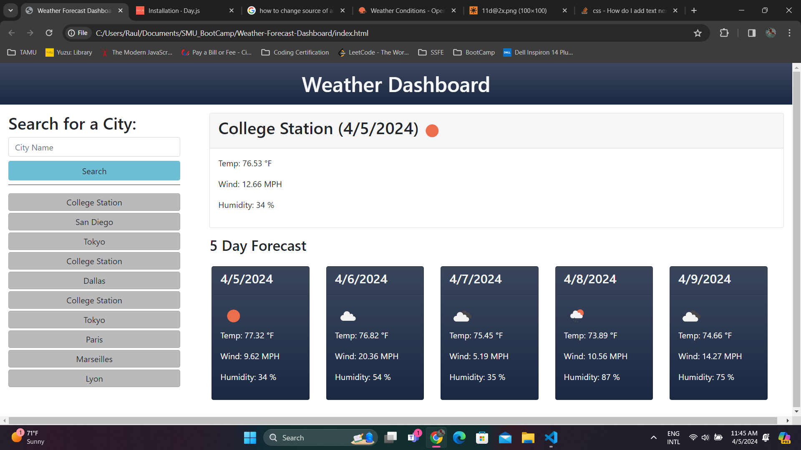

# Weather-Forecast-Dashboard

## Description

A dashboard that enables users to search the name of a city and view the current weather conditions as well as the weather conditions at mid-day over the next five days. The dashboard additionally displays the ten most recent searches made by the user. The main display shows the city name, current date, and weather conditions. This webpage uses the Open Weather API to fetch information about current weather conditions and for weather forecast over a five day period. Queries by the user are saved to local storage, and reload upon refresh of the page.

## Link

[Click Here to Deploy Page](https://raulds-fmtx.github.io/Weather-Forecast-Dashboard/)

## Usage

To view the weather conditions and forecast for a given city, type the city name into the search bar and click search.

## Credits

Created by Raul Santos

## License

Please refer to the LICENSE in the repo.
